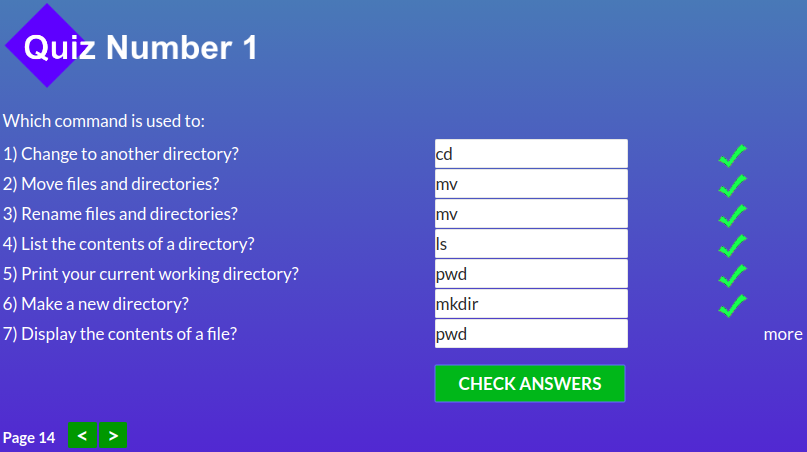
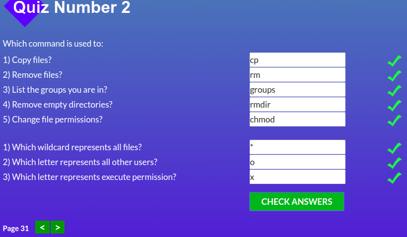
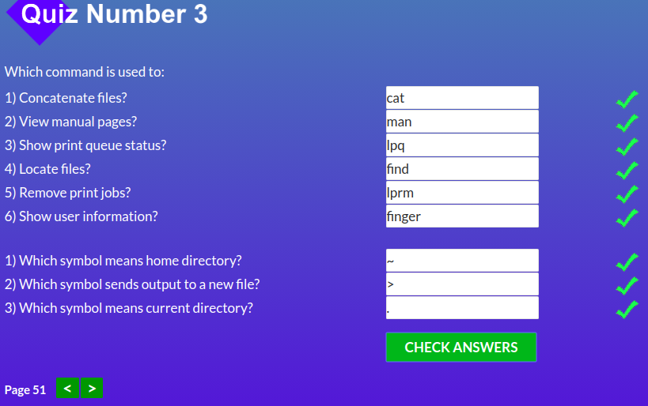
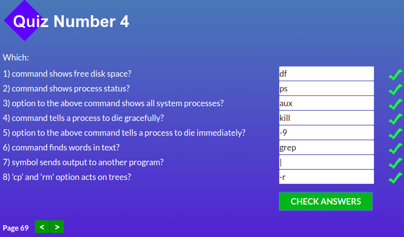
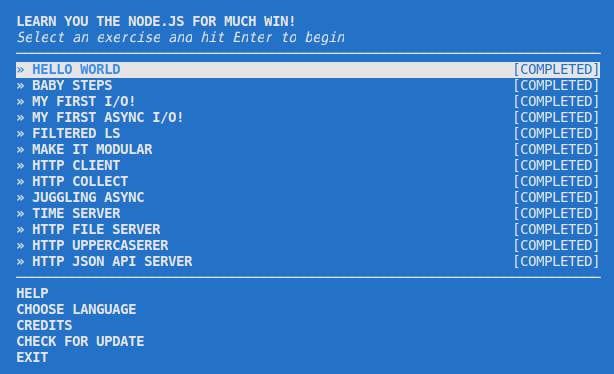

# My progress in Kottans backend course

## Unix Shell

I use some Unix commands in everyday work but in `Linux Survival` task, I have learned a few commands which I have not known yet.

<table>
  <tr>
    <td>  </td>
    <td>  </td>
  </tr>
  <tr>
    <td>  </td>
    <td>  </td>
  </tr>
</table>

## Git Collaboration

I did this task when I have studied at the Front-end course, also I use git at work.

[Screens here](https://github.com/vladk96/kottans-frontend#git-collaboration)

## JavaScript & NodeJS Basics. Part I

<table>
  <tr>
    <td>  </td>
    <!--<td>  </td>-->
  </tr>
  <tr>
    <!--<td>  </td>-->
    <!--<td>  </td>-->
  </tr>
</table>
